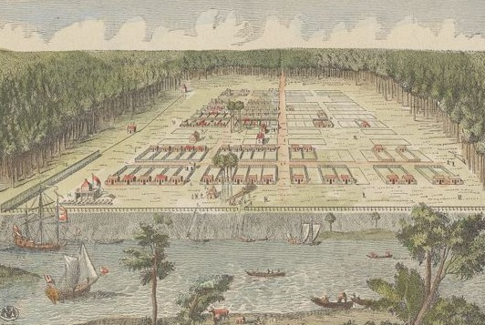

#**Explore the origins of a New Nation through the experiences of Revolutionary Georgia.**

Wedged between two colonies on opposites sides of the Revolution, geographically, Georgia is unique in the history of the American Revolution. If we consider the conflict as a civil war, that is no colony in which this rang more true than in Georgia. . .  Use these visualizations to learn about the broad influences which pushed Georgians to take sides in this imperial crisis. 

This project is the culmination of two difference investigations into lenses in which to investigate how loyalties are made during the American Revolution. “On the Edge of Revolution” helps us visualize how geography, economics, and trade help shape cultural connections and divide a young English colony living on the edge of revolution. 

---

##**Interactive Maps of Revolutionary Georgia**
This project compiles information from over 40 Loyalist Claims and 200 Ship logs across the Atlantic World. Search and analyze these maps for information on the broad impacts and ramifications trade, culture, and loyalities had on leading the southernmost American colony towards independance.

Loyalist Map     Trade Routes     Pictures 

---

Below are a couple of ways you might include images in your site. The simplest is to use Markdown's image method. Use a !, then put the alt text you want inside of square brackets, and the link inside of parentheses.

---

If you want to layout two images side by side, you can use Markdown's tables to organize them into a table of two or more columns... you can add rows for captions if you want.

|  |  |
| Caption 1 | Caption 2 |

---

If you want a single image, center aligned... you have to use raw HTML... use this as a guide, and replace the filename with yours

    

