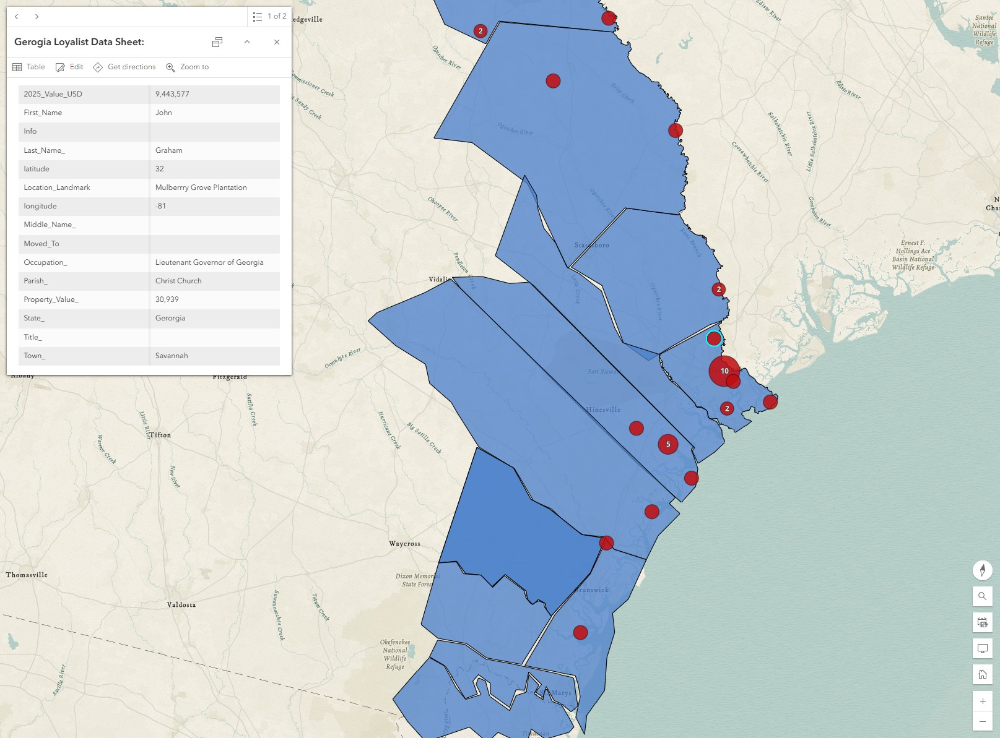
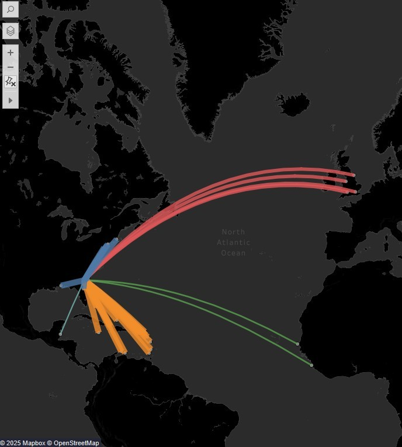

  

    <h1 class="text-4xl md:text-5xl font-bold text-gray-900 mb-6">Loyalism in Revolutionary Georgia</h1>
    

      This project investigates Georgia during the American Revolution.
      While most historical treatments of Loyalism have focused on New York or the Carolinas, Georgia has often been overlooked—despite being the
      only colony successfully reclaimed by British forces after the outbreak of war. This digital project reconstructs the locations, loss of property, and
      motivations of Georgia's Loyalists by mapping key individuals and commercial trade networks.
    

  

  <!-- Centered Image block -->
  

    

      
      
Map of Savannah (c. 1733)

    

  

  <!-- History Links Section -->
  

    <a href="/GeorgiaLoyalist/history/colonial-georgia" class="bg-black text-white px-6 py-3 rounded-xl text-center hover:bg-gray-800 transition w-full sm:w-auto">
      Colonial Georgia
    </a>
    <a href="/GeorgiaLoyalist/history/loyalists" class="bg-black text-white px-6 py-3 rounded-xl text-center hover:bg-gray-800 transition w-full sm:w-auto">
      Loyalists in the Revolution
    </a>
  

  <!-- Section with visualizations -->
  

    

      
      <h2 class="text-xl font-semibold text-gray-800 mb-2">Loyalist Network Visualization</h2>
      

        Explore how commercial trade created cultural ties which influenced Georgians' loyalties. This visualization maps Loyalist locations and connections across the colony through economic relationships.
      

      <a href="/GeorgiaLoyalist/Gloyalists" class="bg-black text-white px-5 py-2 rounded-xl hover:bg-gray-800 transition">View Network Map</a>
    

    

      
      <h2 class="text-xl font-semibold text-gray-800 mb-2">Trade Network Map</h2>
      

        This visualization explores the flow of goods, credit, and loyalty. Discover how merchant activity and port access shaped the political decisions of frontier communities.
      

      <a href="/GeorgiaLoyalist/trade" class="bg-black text-white px-5 py-2 rounded-xl hover:bg-gray-800 transition">View Trade Networks</a>
    

  

  <!-- Concluding paragraph -->
  

    <h2 class="text-2xl font-bold text-gray-900 mb-4">Why It Matters</h2>
    

      This project challenges traditional narratives of American unity by recovering the voices and choices of those who remained loyal to the British Crown. 
      Through visualization and the mapping of commercial and cultural ties, it sheds light on the civil conflict that defined the Revolution in Georgia and helps contextualize 
      the broader complexities of allegiance in the American South.
    

  

